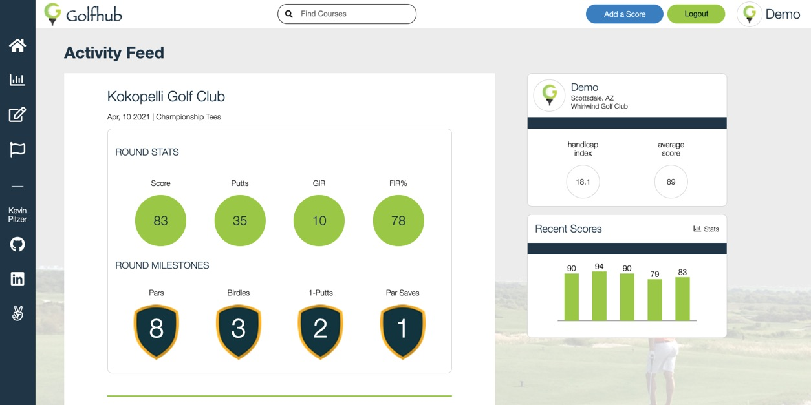
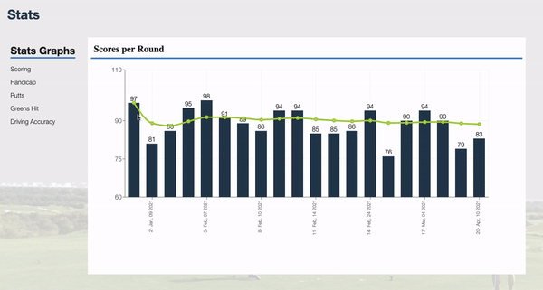

   

<h1 align="center">Golfhub</h1>

See my site hosted on heroku
 <a href="https://golfhub.herokuapp.com/">Golfhub</a> 

&nbsp

<h3 align="center">An app for golfers to explore courses, save rounds, and track a variety of stats.</h3>

&nbsp;

## Key Features

---
- Round overview in dashboard
   - View basic stats and milestones for each round
- Explore or search for courses
- Detailed statistical analysis with trends for your last 20 rounds
- Easy round scores input
   - Default values speed up your score entry after a round

&nbsp;

&nbsp;

## Technologies used

---

- JavaScript
- PostgreSQL
- Python
- Flask
- SQL Alchemy
- React
- Redux
- Google Maps API
- Recharts npm package
- React date-picker npm package
- All styling was done with raw CSS, no frameworks were used.

&nbsp;

